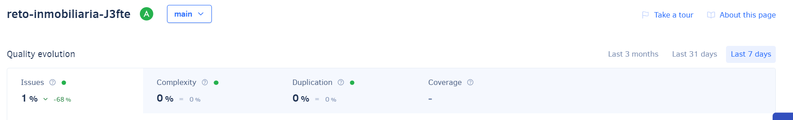

## Table of contents
- [Description](#description)
- [Intallation and Run](#intallation-and-run)
- [Credits](#credits)
- [Badges](#badges)
- [App Screenshots](#app-screenshots)
# App Inmobiliaria

> [Ver instrucciones antes de iniciar](./instructions.md)

##Description
this app show the data of a inmobiliaria, and this information was shown in a flat list, 
for a easy used. And all information comes from a archive json 
Things you may want to cover:

## Installation and Run
- Clone this repo.
- Run `npm install` to install all dependencies.
- Run `npm react-native start` to start the server.
- Run `npm react-native run-android` to run the app on Android.
- Run `npm react-native run-ios` to run the app on iOS.
## Credits
- [BrightCoders](http://www.brightcoders.com/)
- [J3fte](santillanabdiel0@gmail.com)
## Badges
# Qualification with Codacy

